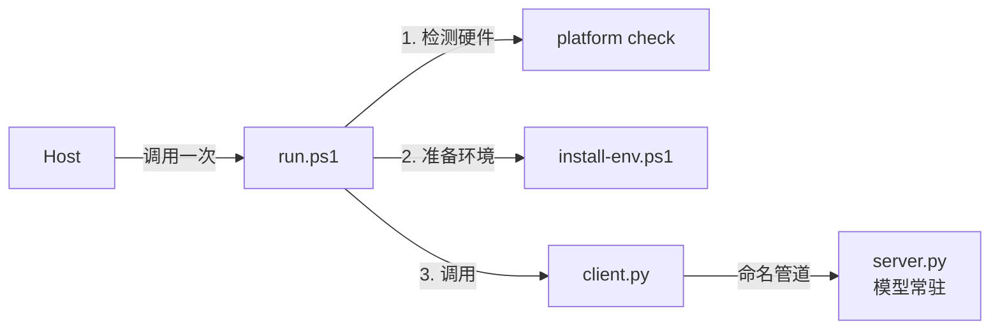

# OpenVINO Pipeline Optimization —— 开发者脚手架 & 参考标准

本技能为开发者提供在 Intel AIPC 上构建多模型 OpenVINO 流水线 demo 的**方向和一套约定** ——
而不是一条现成的流水线。它展示*如何*从 `openvino_notebooks` 发现各阶段、*如何*把各阶段放到
设备/精度上、*如何*做基准测试，以及*如何*用 **client + server** 把它们封装起来。真正的流水线
由用户选定的 notebook 组合搭建而成；开发者补齐各阶段特定的逻辑。本技能提供结构、建议默认值和
诚实的报告 —— 绝不提供预制的流水线。

主线（一条建议路径，按 notebook 需要裁剪/替换）：

**选 notebook → 发现并组合各阶段 → 优化（设备 + 精度）→ 基准测试 → 部署（client+server）→ 封装为可分发的本地 AI skill（可选）**

最后一步（封装）是可选的：当你想把已优化/部署好的流水线打包成一个 Host 应用（Marvis / WorkBuddy /
自定义 host）可通过单一入口脚本调用的**本地 AI skill** 时使用。这部分约定整合自
`local-ai-skill-authoring`，见下方 [封装为本地 AI skill](#封装为可分发的本地-ai-skill) 一节及 `references/`、`assets/`。

### 哪些是固定的 vs. 哪些由你构建

| 固定（本技能标准化的约定） | 由你构建（来自所选 notebook） |
| --- | --- |
| 目录布局、`[SKILL_RESULT]` 契约、生命周期参数 | 阶段图以及各阶段如何连接 |
| client+server *模式*（endpoints、health、501 诚实） | 每个阶段的模型加载 / 转换 / 推理代码 |
| 建议的设备/精度启发式（可覆盖） | 权威的转换 + 推理 —— 从 notebook 复制/改编而来 |

> **脚本是参考，不是法律。** `scripts/` 下的所有内容（`resolve_pipeline.py`、`optimize.py`、
> `bench.py`、`server.py`、`client.py`）都是这些约定的**参考实现**。把它们当作起点，可自由改编。
> 当某个脚本的通用行为（例如一刀切的 `optimum-cli export openvino`）与 notebook 冲突时，
> **以 notebook 为准** —— 它的模型加载、转换和推理才是权威来源。

> **通用为设计原则。** 不硬编码任何 model ID —— 各阶段从所选 notebook 中发现。没有模型族开关。
> 未接入 runner 的流水线族返回 HTTP 501；本技能绝不伪造输出。

---

## !! 关键：环境 / 镜像 / 持久化 !!

| 需求 | 详情 |
| --- | --- |
| Intel AIPC (LNL/ARL/PTL/WCL)、git | 运行前先验证 |
| Python 3.x | **不做硬性锁定** —— 使用所选 notebook 支持的版本（由它的 `requirements.txt` 决定）。venv 用当前 `python` 解析到的版本创建 |
| `--china` | pip=tuna、HF=hf-mirror、notebooks=gitcode；不做网络探测 |
| 持久化目录（sandbox 之外） | `%USERPROFILE%\.openvino\`：`venv-pipeopt\`、`openvino_notebooks\`、`ir\<slug>\`、`log\` |

首次运行时依赖装入持久化 venv：参考脚本所需的**最小核心**
（`openvino, nncf, optimum-intel, fastapi, uvicorn, pydantic, nbformat, numpy` —— 仅当某阶段用到时
再加 `openvino-genai`/`openvino-tokenizers`），**加上每个所选 notebook 自己的 `requirements.txt`**
（`notebooks/<slug>/requirements.txt`），这样模型相关依赖始终与所选 notebook 匹配。没有技能级的静态
requirements 文件，也没有强制的版本锁定 —— 依赖从你构建的 notebook 中解析而来。如果某个 notebook
锁定了自己的 OpenVINO/Python 版本，以 notebook 为准。

---

## 构建 & 优化（参考流程）

下面的命令驱动的是**参考**脚本。它们是方便的起点；真正的转换/推理请优先采用所选 notebook 里的
步骤，并据此改编脚本。

```powershell
# 单个 notebook
run.ps1 --china --slug whisper-asr-genai
# 把多个 notebook 组合成一条流水线
run.ps1 --china --slug whisper-asr-genai,llm-rag-langchain,openvoice2-and-melotts
# 按目标（与仓库的 notebooks/README.md 索引匹配）
run.ps1 --china --goal "local ASR to LLM to TTS"
# 仅解析 + 规划（不下载）
run.ps1 --dry-run --slug vlm-chatbot
```

流程：**resolve**（`resolve_pipeline.py` —— 从 `notebooks/<slug>/` 发现各阶段）→
**optimize**（`optimize.py` —— 一个调用 `optimum-cli export openvino` + NNCF + 设备的参考导出器
→ `pipeline-plan.json`）→ **benchmark**（`bench.py` —— 逐阶段 + 端到端、瓶颈、`[SKILL_RESULT]`）。

> 参考的 `optimize.py` 用的是单一通用的 `optimum-cli export openvino`。它对很多标准模型有效，但
> **并不权威**：如果 notebook 以特定方式转换模型（自定义 export 参数、`ov.convert_model`、手写
> NNCF 配置、stateful/GenAI 导出、多个子模型），请把导出调用替换为 notebook 自己的转换方式。推理
> 同理 —— notebook 的运行时代码才是参考，而不是 `server.py` 的通用执行器。

**建议的**每角色设备/精度启发式（仅为默认值，始终可通过 `--device` / `--precision` 覆盖，并被
notebook 的实际做法取代）：LLM→GPU/INT4、encoder→GPU/INT8、retriever→CPU/INT8、pre/post→CPU/FP16。

### `[SKILL_RESULT]`（构建/基准测试契约）
```
[SKILL_RESULT]
status=ok|error|timeout
pipeline=<slug or a+b+c>
stages=asr:GPU/INT8/312ms; llm:GPU/INT4/540ms; tts:CPU/FP16/120ms
e2e_latency_ms=972
throughput=...
bottleneck=llm
ir_dir=%USERPROFILE%\.openvino\ir\<slug>
[/SKILL_RESULT]
```

---

## 部署流水线（client + server）

把构建并优化好的流水线部署为本地 HTTP 服务，然后用 CLI client 与之交互。

```powershell
run.ps1 --serve --slug whisper-asr-genai [--port 18790]   # 构建+优化（复用 IR）后部署
```

`--serve` 会 resolve → optimize（复用已有 IR）→ 在后台启动 `server.py` → 轮询 `/api/health` →
输出带 `service_url` 的 `[SKILL_RESULT]` 并打印 client 用法。

**架构**
```
 CLI / HTTP client  ──HTTP :18790──▶  server.py (FastAPI)  ──▶  OpenVINO pipeline stages (from pipeline-plan.json)
   client.py / curl                     /api/run · /api/health · /v1/chat/completions · /api/shutdown
```

**Endpoints**（服务运行在 `127.0.0.1:18790`）

| Endpoint | Method | 用途 |
| --- | --- | --- |
| `/api/health` | GET | 状态 + 各阶段加载情况 |
| `/api/run` | POST | 通用执行器：`{input, params}` → `{output, per_stage_ms, e2e_ms}` |
| `/v1/chat/completions` | POST | 兼容 OpenAI（chat/LLM & RAG 族） |
| `/api/shutdown` | POST | 优雅退出 |

**Client**
```powershell
python scripts\client.py --health
python scripts\client.py --run --input "your input"
python scripts\client.py --chat "hello"          # chat/RAG 流水线
curl http://127.0.0.1:18790/api/health
```

**诚实原则：** 未接入 runner 的流水线族返回 **HTTP 501**（"runner for family 'X' not implemented
yet"）—— 开发者用 **notebook 自己的推理代码**在 `server.py::PIPELINE_RUNNERS` 中接入该族的 runner。
绝不伪造。`server.py --stub` 返回预设输出，用于在没有硬件的情况下接线/测试 client。通用的 `/api/run`
执行器只是一层便捷外壳，不能替代 notebook 的流水线逻辑。

---

## 封装为可分发的本地 AI skill

> 本节整合自 [`local-ai-skill-authoring`](https://github.com/openvino-dev-samples/local-ai-skill-authoring)。
> 上面的 client+server 是**开发/本地服务**形态（HTTP/FastAPI）。当你要把这条已构建、已优化、已验证的
> 流水线**分发**给一个 Host 应用（Marvis / WorkBuddy / 自定义 host）时，把它打包成一个遵循固定约定的
> **本地 AI skill**：Host 只调用一个固定入口脚本 `scripts\run.ps1`，其余都是它背后的实现细节。

### 核心心智模型

本地 AI skill 有**唯一固定入口** `scripts\run.ps1`，Host 调用它，其余都在它背后：



两种可选架构（用 [references/architecture.md](./references/architecture.md) 的表来选）：

| 条件 | 架构 |
| --- | --- |
| 模型加载 > 10s、内存 > 1GB，或频繁调用 | **Client-Server**（推荐；多阶段流水线基本都属于此类） |
| 模型加载 < 10s **且**很少被调用 | **Single-Client** |

> 传输层区别：开发/本地服务用 **HTTP/FastAPI**（`scripts/server.py`）；面向 Marvis 式 Host 分发时用
> **命名管道**（见 architecture.md）。两者的阶段加载与逐阶段推理逻辑一致，只是传输层不同。

### 打包目录布局

```
local-<function>/
├── SKILL.md            # 路由规范（Host 用 frontmatter 的 description 匹配意图）
├── info.json           # 运行时配置：venv、python 版本、mem_need_gb、models（每个阶段 IR 一条）
├── meta.json           # 商店元数据：显示名、图标、use_cases
├── requirements.txt    # Python 依赖（须含 openvino + 模型下载器；叠加所选 notebook 的依赖）
├── scripts/
│   ├── run.ps1         # 固定名入口 —— 永不改名
│   ├── client.py       # 短生命周期 CLI client
│   ├── server.py       # （可选）常驻模型 server
│   └── <helper>.py     # 领域辅助
├── assets/             # （可选）静态资源
├── wheels/             # （可选）预编译 .whl
└── tests/
    └── test.ps1        # 端到端测试
```

### 封装步骤

1. **确认意图** —— 目标 Host（Marvis / 自定义 / 无）？Client-Server 还是 Single-Client？
2. **搭目录** —— 从 `./assets/` 复制模板；目录改名为 `local-<function>`（如 `local-asr-llm-tts`）。
3. **填 `info.json`** —— venv 名、python 版本、`mem_need_gb`（对流水线要**汇总所有常驻阶段**的显存/内存）、`models` 列表（**每个阶段 IR 一条**，含 `required_files`）。见 [references/file-reference.md](./references/file-reference.md)。
4. **写 `SKILL.md`** —— 关键词丰富的中英双语 `description` 供 Host 路由。见 file-reference.md 的路由规则与 [assets/SKILL.template.md](./assets/SKILL.template.md)。
5. **填 `meta.json`** —— display_name、use_cases、version。
6. **实现 `client.py`（+ `server.py`）** —— 遵循[命名管道协议与状态机](./references/architecture.md)；stdout/stderr 配置 UTF-8。可直接复用本 skill `scripts/` 里已跑通的阶段加载/推理逻辑，替换传输层。
7. **接入模型下载 + 续传** —— 原子 `.partial` 下载、`required_files` 校验、`--continue` 超时协议。见 [references/model-and-env.md](./references/model-and-env.md)。
8. **写 `requirements.txt`** —— 含 `openvino` 和模型下载器（如 `modelscope`）；锁定关键版本；叠加所选 notebook 自己的依赖。
9. **写 `run.ps1`** —— 硬件检测 → 装环境 → 启动 client；首行 `$ErrorActionPreference = 'Stop'`。
10. **测试** —— 首次下载（含 `--continue`）、非 AIPC 报错路径、编码、退出码。见 [references/best-practices.md](./references/best-practices.md) 的清单。

### 参考文档 & 模板

| 主题 | 文档 |
| --- | --- |
| 架构、命名管道协议、server 状态机、进程管理器 | [references/architecture.md](./references/architecture.md) |
| 每个文件的职责 + SKILL.md 路由规则 | [references/file-reference.md](./references/file-reference.md) |
| 模型下载+续传协议、venv、设备选择、内存预算 | [references/model-and-env.md](./references/model-and-env.md) |
| 退出码、日志、编码、常见坑、构建清单 | [references/best-practices.md](./references/best-practices.md) |

| 模板 | 用途 |
| --- | --- |
| [assets/SKILL.template.md](./assets/SKILL.template.md) | 带路由 frontmatter 的 SKILL.md 骨架 |
| [assets/info.template.json](./assets/info.template.json) | 运行时配置 |
| [assets/meta.template.json](./assets/meta.template.json) | 商店元数据 |
| [assets/requirements.template.txt](./assets/requirements.template.txt) | Python 依赖 |
| [assets/run.template.ps1](./assets/run.template.ps1) | 入口脚本 |
| [assets/client.template.py](./assets/client.template.py) | 短生命周期 client |
| [assets/server.template.py](./assets/server.template.py) | 常驻模型 server |

### Host 相关 vs 可复用

可复用核心：目录布局、`run.ps1` 入口契约、client-server 拆分、命名管道协议、模型下载+续传、venv 管理、
SKILL.md 路由约定。以下是**特定 Host（如 Marvis）的参考实现**，换 Host 时可替换/丢弃：`platform.exe
--is-aipc` 硬件门、`server-dog` 进程/内存管理器、`~/.openvino/` 固定目录树、共享 `model_download.py`。
换成非 Marvis 的 Host 时，保留核心、替换这些 Host 相关件即可。

---

## 生命周期 & 参数

| 参数 | 含义 |
| --- | --- |
| `--slug a[,b,c]` | 一个或多个 notebook slug（逗号 = 按顺序组合） |
| `--goal "…"` | 自由描述的目标 → 通过仓库索引匹配到 slug |
| `--device / --precision` | 覆盖每角色默认值 |
| `--serve [--port N]` | 构建+优化，然后部署（默认端口 18790） |
| `--china` | 锁定国内镜像 |
| `--dry-run` | 仅解析 + 规划 |
| `--status` | venv / notebooks / 上次 plan / **服务**状态（以 `[SKILL_RESULT]` 输出） |
| `--stop` | POST `/api/shutdown`，然后杀掉 pidfile + 残留进程 |
| `--debug` | 详细诊断（venv、repo、设备、最近日志） |

退出码 `0` 成功 / `1` 出错。幂等：重跑会复用已克隆的仓库 + 已有 IR（标 `from IR`）。

## 排错（简要）
- **repo-required / goal-unresolved** → 让 `--serve`/构建先克隆仓库；细化 `--goal` 或传 `--slug`。
- **no static model ids found** → 该 notebook 动态获取模型；显式提供该阶段的模型，或先跑一次 notebook。
- **/api/run 501** → 在 `server.py::PIPELINE_RUNNERS` 中接入该族的 runner（设计如此）。
- **service not healthy** → `run.ps1 --debug`；检查端口、venv 依赖、`%USERPROFILE%\.openvino\log\` 下的最近日志。

## 做什么 / 不做什么
- **做：** 为基于仓库的流水线提供方向 + 约定；从 notebook 发现各阶段；建议每阶段设备/精度；基准测试；提供 `[SKILL_RESULT]` + client/server *模式*；多 notebook 组合；离线/`--china`；把流水线封装为可分发的本地 AI skill（目录布局 + `run.ps1` 入口 + client-server 命名管道 + 模型下载续传 + 路由）。
- **不做：** 交付现成的流水线；强制把随附脚本作为执行路径；臆想模型架构；硬编码 model ID 或 Python/OpenVINO 版本；覆盖 notebook 的转换/推理；云端/非 Intel；为未接入的族伪造输出；训练或导出/量化模型（封装时复用已有 IR）。

## 测试
运行离线冒烟测试（无需模型、无需克隆、无需 Intel 硬件）来验证编排 ——
resolve → optimize `--dry-run` → bench `--dry-run` → client `--help` → `--status`：
```powershell
powershell -ExecutionPolicy Bypass -File test_pipeline.ps1
```
退出码 `0` = 所有检查通过。它会在临时目录里构建一个极小的合成 notebooks 仓库，并断言发现的各阶段、
plan 文件和 `[SKILL_RESULT]` 块。
